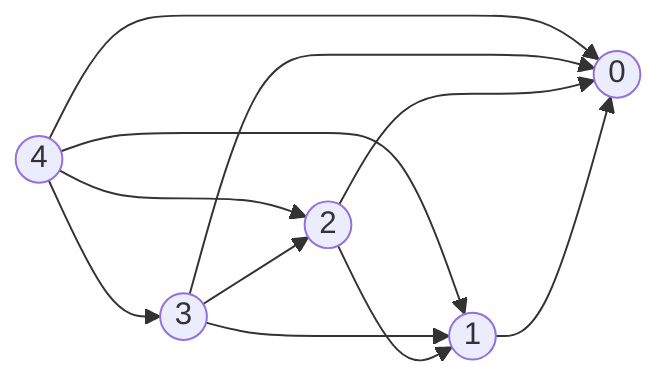

## 问题描述

Serling公司购买长钢条，将其切割成短钢条出售，切割本身没有成本支出。价格表样例如下

| 长度$i$  | 1    | 2    | 3    | 4    | 5    | 6    | 7    | 8    | 9    | 10   |
| -------- | ---- | ---- | ---- | ---- | ---- | ---- | ---- | ---- | ---- | ---- |
| 价格$Pi$ | 1    | 5    | 8    | 9    | 10   | 17   | 17   | 20   | 24   | 30   |

给定价格表和长度为n的钢条，求最佳切割方案是收益最大化。

<!-- more -->

## 分析

下图为n = 4时的子问题图。



钢条切割问题是一个经典的动态规划问题。针对一个动态规划问题，我们一般分为四步来进行解决：

1. 寻找问题的最优子结构
2. 从上往下递归
3. 边界值
4. 从下往上求解


## 代码实现

### 自顶向下递归实现

```java
public int cutRod(int [] p, int n) {
    if(0 == n) {
        return 0;
    }
    int q = -1;
    for(int i = 1; i <= n; i++) {
        q = Math.max(q, p[i] + cutRod(p,n-i));
    }
    return q;
}
```

递归实现的时间复杂度为$\Theta(2^n)$. 包含大量求解重复子问题的操作。

### 带备忘的自顶向下法

```java
public int memorizedCutRod(int [] p, int n) {
    // 用一个数组保存子问题的解，保证每个子问题只求解一次
    int [] r = new int [n+1];
    // 初始化为一个负数
    for(int i=1; i<=n; i++) {
        r[i] = -1;
    }
    return memorizedCutRodAux(p, n, r);

}

/**
     * 带备忘的自顶向下法，保证每个子问题只求解一次
     * @param p 用数组保存价格表
     * @param n 钢条的长度为n
     * @param r 备忘录保存已经求得的值
     * @return 一个最优解
     */
private int memorizedCutRodAux(int[] p, int n, int[] r) {
    // 如果子问题已经求解，则返回结果
    if(r[n] >= 0) {
        return r[n];
    }
    int q;
    if(n == 0) {
        q = 0;
    } else {
        q = -1;
        // 递归求解最优解
        for(int i=1; i<=n; i++) {
            q = Math.max(q, p[i] + memorizedCutRodAux(p, n-i, r));
        }

    }
    // 记录子问题的最优解
    r[n] = q;
    return q;
}
```

### 自底向上求解

```java
/**
     * 自底向上求解
     * @param p 钢条切割价格表
     * @param n 给定的钢条长度
     * @return 一个最优解
     */
public int bottomUpCutRod(int [] p, int n) {
    // 创建一个新数组用来保存子问题的解
    int [] r = new int[n+1];
    r[0] = 0;
    for(int j=1; j<=n; j++) {
        int q = -1;
        for(int i=1; i<=j; i++) {
            q = Math.max(q, p[i] + p[j-i]);
        }
        r[j] = q;
    }
    return r[n];
}
```

**时间复杂度**：双重for循环, $\Theta(n^2)$

**空间复杂度**: $\Theta(n)$

### 重构解

上面的实现给出的是最优解的值，但是并没有告诉具体该如何切割。

```java
public int [] extendedBottomUpCutRod(int [] p, int n) {

    int [] r = new int[n+1];
    // 数组s保存每个节点的最优切割方案
    int [] s = new int[n+1];
    r[0] = 0;
    for(int j=1; j<=n; j++) {
        int q= -1;
        for(int i = 1; i <= j; i++) {
            if(q < (p[i] + p[j-i])) {
                q = p[i] + p[j-i];
                s[j] = i;
            }
        }
        r[j] = q;
    }

    return s;
}
```

### 测试用例

```java
@Test
public void test() {
    int [] p = {0,1,5,8,9,10,17,17,20,24,30};
    int n = 10;
    //int result = cutRod(p, n);
    //int result = memorizedCutRod(p, n);
    int result = bottomUpCutRod(p, n);
    System.out.println(result);

    //
    int [] s = extendedBottomUpCutRod(p, n);
    System.out.println(s[n]);
}
```


[具体代码实现](https://github.com/shawn520/algorithms/blob/master/src/leetcode/dynamicProgramming/ClimbingStairs.java)

## 参考资料

算法导论

