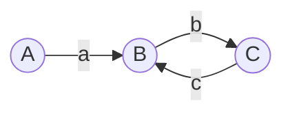

## 问题描述

给一个链表，若其中包含环，请找出该链表的环的入口结点，否则，输出null。



<!-- more -->

链表节点的定义

```java
class ListNode {
    int val;
    ListNode next = null;

    ListNode(int val) {
        this.val = val;
    }
}
```


## 分析

拆分为两步。判断是否有环和寻找入口节点。


如图，假设A为头结点，B为环的入口节点，C为相遇节点。AB的长度为a，BC的长度为b，CB的长度为c

则可以推出以下信息

链表的长度  $n = a + b + c$

环的长度  $length = b + c$
$$
相遇点： quick =  a + ( b + c ) * k + b (k = 1,2,...)\\
		slow   =  a + b\\
		又 quick = 2 * slow\\
		则 a + ( b + c ) * k + b = 2 * slow\\
		=> a = ( k - 1) * (b + c) + c (k = 1,2,...)
$$

### 1. 判断是否有环

两个指针，同时出发，quick每次跳两格，slow每次跳一格，
如果quick追上slow则说明有环。

### 2. 寻找入口节点


## 代码实现

时间复杂度$\Theta(n)$

空间复杂度$O(1)$

```java
public ListNode EntryNodeOfLoop(ListNode pHead) {
    // 判断是否有环
    Boolean circle = false;
    ListNode p = pHead;
    ListNode q = pHead;
    while (null != p && null != p.next) {
        p = p.next.next;
        q = q.next;
        if(p == q) {
            circle = true;
            break;
        }
    }

    // 如果有环，则寻找环的入口点
    if(circle) {
        p = pHead;
        while (p != q) {
            p = p.next;
            q = q.next;
        }
        return p;
    }
    return null;
}
```


### 测试用例

```java
@Test
public void test() {
    // 功能测试
    ListNode node1 = new ListNode(1);
    /*ListNode node2 = new ListNode(2);
        ListNode node3 = new ListNode(3);
        ListNode node4 = new ListNode(4);
        ListNode node5 = new ListNode(5);
        ListNode node6 = new ListNode(6);
        node1.next = node2;
        node2.next = node3;
        node3.next = node4;
        node4.next = node5;
        node5.next = node6;*/
    // 是否有环
    //node6.next = node3;

    // 边界测试
    // 空链表
    // ListNode node1 = null;

    ListNode node = EntryNodeOfLoop(node1);
    System.out.println(node.val);

}
```


[具体代码实现](https://github.com/shawn520/algorithms/blob/master/src/offer/group5/test56/Solution.java)

## 参考资料

剑指Offer

