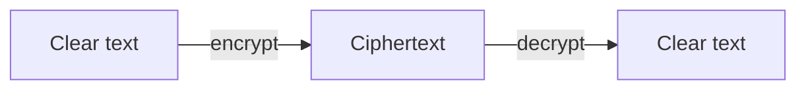

<!-- more -->

## 常用对称加密算法比较

1）DES（Data Encryption Standard，数据加密标准）
2）3DES（Triple DES、DESede，进行了三重DES加密的算法）
3）AES（Advanced Encryption Standard，高级数据加密标准，AES算法可以有效抵制针对DES的攻击算法）


| 算法 | 秘钥长度      | 默认秘钥长度 | 工作模式                                                     | 填充方式                                 | 对比                                                         |
| ---- | ------------- | ------------ | ------------------------------------------------------------ | ---------------------------------------- | ------------------------------------------------------------ |
| DES  | 56            | 56           | ECB、CBC、PCBC、CTR、CTS、CFB、CFB8-CFB128、OFB、OFB8-OFB128 | NoPadding、PKCS5Padding、ISO10126Padding | 数据加密标准，是对称加密算法领域中的典型算法 2.特点：密钥偏短（56位）、生命周期短（避免被破解） |
| 3DES | 112、168      | 168          | ECB、CBC、PCBC、CTR、CTS、CFB、CFB8-CFB128、OFB、OFB8-OFB128 | NoPadding、PKCS5Padding、ISO10126Padding | 将密钥长度增至112位或168位，通过增加迭代次数提高安全性 2.缺点：处理速度较慢、密钥计算时间较长、加密效率不高 |
| AES  | 128、192、256 | 128          | ECB、CBC、PCBC、CTR、CTS、CFB、CFB8-CFB128、OFB、OFB8-OFB128 | NoPadding、PKCS5Padding、ISO10126Padding | 高级数据加密标准，能够有效抵御已知的针对DES算法的所有攻击 2.特点：**密钥建立时间短、灵敏性好、内存需求低、安全性高** |

通过比较以上几种开源加密算法，AES加密码算法密钥建立时间短、灵敏性好、内存需求低、安全性高。

## AES的java实现

类变量定义：

```java
private static final String KEY_ALGORITHM = "AES";
// 默认的加密算法
private static final String DEFAULT_CIPHER_ALGORITHM = "AES/ECB/PKCS5Padding";
private static String KEY = getKey();
```

### 加密

```java
/**
 * AES 加密
 *
 * @param content 待加密内容
 * @param key 加密密钥
 * @return 返回Base64转码后的加密数据
 */
private static String aesEncrypt(String content, String key) {
    try{
        Cipher cipher = Cipher.getInstance(DEFAULT_CIPHER_ALGORITHM); //创建密码器
        byte [] byteContent = content.getBytes("utf-8");
        cipher.init(Cipher.ENCRYPT_MODE, getSecretKey(key)); //初始化为加密模式的密码器
        byte [] result = cipher.doFinal(byteContent);   //加密
        return Base64.getEncoder().encodeToString(result);  //通过Base64转码返回
    }catch (Exception e) {
        e.printStackTrace();
    }
    return null;
}
```

### 解密

```java
/**
 * AES 解密操作
 *
 * @param content the String to decrypt
 * @param key the key to decrypt the content.
 * @return the String after decrypt.
 */
private static String aesDecrypt(String content, String key) {

    try{
        // 实例化
        Cipher cipher = Cipher.getInstance(DEFAULT_CIPHER_ALGORITHM);
        // 使用密钥初始化，设置为解密模式
        cipher.init(Cipher.DECRYPT_MODE, getSecretKey(key));
        // 执行解密操作
        byte [] result = cipher.doFinal(Base64.getDecoder().decode(content));
        return new String(result, "utf-8");
    }catch (Exception e) {
        e.printStackTrace();
    }
    return null;
}
```

### 生成加密秘钥

```java
/**
 * 生成加密秘钥
 *
 * @return a generated secret key.
 */
private static SecretKeySpec getSecretKey(final String key) {
    //返回生成指定算法密钥生成器的 KeyGenerator 对象
    KeyGenerator keyGenerator;

    try{
        keyGenerator = KeyGenerator.getInstance(KEY_ALGORITHM);

        SecureRandom secureRandom = SecureRandom.getInstance("SHA1PRNG");
        secureRandom.setSeed(key.getBytes());

        // AES 要求密钥长度为 128
        keyGenerator.init(128, secureRandom);

        // 生成一个秘钥
        SecretKey secretKey = keyGenerator.generateKey();

        // 转换为AES专用秘钥
        return new SecretKeySpec(secretKey.getEncoded(), KEY_ALGORITHM);

    }catch (NoSuchAlgorithmException e) {
        e.printStackTrace();
    }
    return null;
}
```

## 异或加密实现

### 异或加密

```java
private static String XOREncrypt(String content, String key){
    byte [] contentBytes = new byte[0];
    byte [] keyBytes = new byte[0];
    try {
        contentBytes = content.getBytes("utf-8");
        keyBytes = key.getBytes("utf-8");
    } catch (UnsupportedEncodingException e) {
        e.printStackTrace();
    }
    byte [] encryptBytes = new byte[contentBytes.length];
    for(int i=0;i<contentBytes.length;i++) {
        encryptBytes[i] = (byte)(contentBytes[i] ^ keyBytes[i%keyBytes.length]);
    }

    // 通过Base64转码返回
    return Base64.getEncoder().encodeToString(encryptBytes);
}
```

### 异或解密

```java
private static String XORDecrypt(String content, String key){
    byte [] contentBytes = Base64.getDecoder().decode(content);
    byte [] keyBytes = new byte[0];
    try {
        keyBytes = key.getBytes("utf-8");
    } catch (UnsupportedEncodingException e) {
        e.printStackTrace();
    }
    byte [] encryptBytes = new byte[contentBytes.length];
    for(int i=0;i<contentBytes.length;i++) {
        encryptBytes[i] = (byte)(contentBytes[i] ^ keyBytes[i%keyBytes.length]);
    }
    try{
        return new String(encryptBytes,"utf-8");

    }catch (UnsupportedEncodingException e){
        e.printStackTrace();
    }
    return null;
}
```

## AES加异或

### 加密

```java
/**
     * 加密
     *
     * @param content 待加密内容
     * @return 返回aes加密和异或操作之后的加密数据
     */
public static String encrypt(String content){
    // logger.info("获取的key为:" + KEY);
    String encrypt = aesEncrypt(content,KEY);
    return XOREncrypt(encrypt,KEY);
}
```

### 解密

```java
/**
     * 解密
     *
     * @param content the String to decrypt
     * @return the String after xor & decrypt.
     */
public static String decrypt(String content){
    String afterXOR = XORDecrypt(content,KEY);
    return aesDecrypt(afterXOR,KEY);
}
```


## 注

用base64编码解决ascII中的不可见字符问题
windows和Linux系统 SecureRandom 类中 setSeed（）底层调用的是 native 方法.

所以造成了不同环境之间随机数出现了差别。导致不同平台下解密不一致问题。 

所以

```java
keyGenerator.init(128, new SecureRandom((key.getBytes())));
```

需要改为生成强随机数

```java
SecureRandom secureRandom = SecureRandom.getInstance("SHA1PRNG");
secureRandom.setSeed(key.getBytes());
// AES 要求密钥长度为 128
keyGenerator.init(128, secureRandom);
```

使得AES加密解密算法支持跨平台。

具体代码实现（）

## 参考资料

十分钟读懂AES加密算法（https://blog.csdn.net/u012721519/article/details/79612516）

AES算法简介(https://blog.csdn.net/u012721519/article/details/79612128)