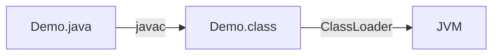
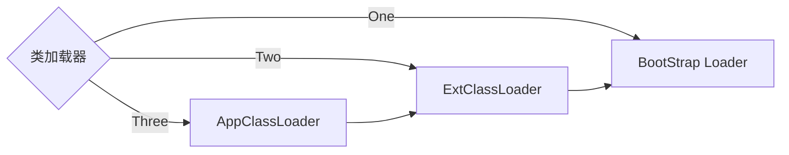
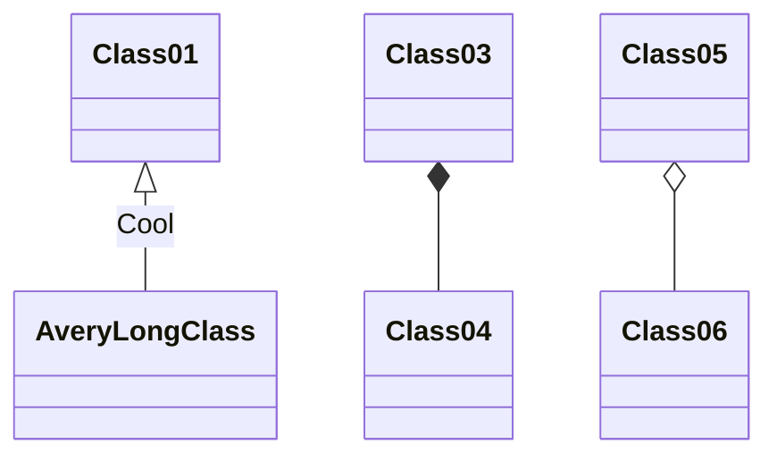

导读

<!-- more -->

Java是动态解释性语言，类(class)只有被加载到JVM中才能运行。

首先，由编译器将java文件编译成虚拟机可以执行的class文件。然后类加载将class文件加载到JVM中执行。

加载过程是由类加载器（ClassLoader和它的子类）共同完成的, 类加载器本身也是一个类。

## 加载方式

类的加载方式分为**显示加载**和**隐式加载**。

**隐式加载**：就是通过`new`关键字创建对象时，会隐式的调用类的加载器将相应的类加载到JVM中。

**显示加载**：就是通过直接调用`class.forName()`方法，将所需的类加载到JVM中。

## 类加载实质

实质就是把类文件由硬盘加载到JVM内存。

## 动态加载

在Java语言中，类的加载是**动态**的，不会将所有的类一次全部加载到内存中，而是首先将保证程序正常运行的基础类加载到内存中，其他的类**按需加载**。

**按需动态加载的好处**：

1. 加快加载速度
2. 节省内存开销
3. 加快编译速度。当部分类被修改时，只需要重新编译被修改了的类，从而大大加快编译速度。

## 类加载器分类

在java中，可以将类分成3类：系统类、扩展类（平台类）、应用类。针对不同的类提供不同的类加载器，类加载器的关系如下：

## 参考资料

https://mermaidjs.github.io/#/README

