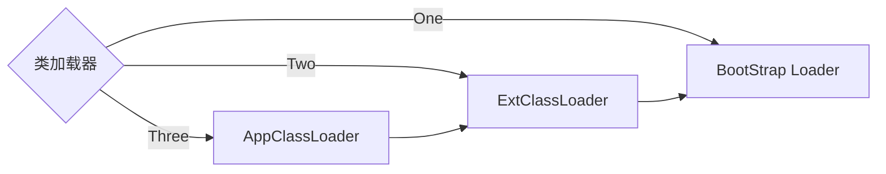

<!-- more -->

Java是动态解释性语言，类(class)只有被加载到JVM中才能运行。


首先，由编译器将java文件编译成虚拟机可以执行的class文件。然后类加载将class文件加载到JVM中执行。

加载过程是由类加载器（ClassLoader和它的子类）共同完成的, 类加载器本身也是一个类。


## 加载方式

类的加载方式分为**显示加载**和**隐式加载**。

**隐式加载**：就是通过`new`关键字创建对象时，会隐式的调用类的加载器将相应的类加载到JVM中。

**显示加载**：就是通过直接调用`class.forName()`方法，将所需的类加载到JVM中。


## 类加载实质

实质就是把类文件由硬盘加载到JVM内存。

## 动态加载

在Java语言中，类的加载是**动态**的，不会将所有的类一次全部加载到内存中，而是首先将保证程序正常运行的基础类加载到内存中，其他的类**按需加载**。

**按需动态加载的好处**：

1. 加快加载速度
2. 节省内存开销
3. 加快编译速度。当部分类被修改时，只需要重新编译被修改了的类，从而大大加快编译速度。

## 类加载器分类

在java中，可以将类分成3类：系统类、扩展类（平台类）、应用类。针对不同的类提供不同的类加载器，类加载器的关系如下：




## 类加载原理

上图所述的三个类加载器是如何协作完成类加载的呢？

他们是通过**Parents Delegation Model**实现的, 译为**朔源委派加载模型**。

1. BootStrap Loader系统类加载器。在JVM启动时创建，由C++实现，负责加载核心的Java类，例如Object、System、String等。
2. Extention ClassLoader(在JDK9以后成为Platform ClassLoader) 扩展类加载器。用以加载扩展的系统类。
3. Applcation ClassLoader 应用类加载器，主要是加载用户定义的CLASSPATH路径下的类。

他们通过组合的方式来复用父加载器的功能。

类加载的例子：

```java
public class TestLoader {
    public static void main(String[] args) {
        ClassLoader appClassloader = TestLoader.class.getClassLoader();
        System.out.println(appClassloader);

        ClassLoader extClassLoader = appClassloader.getParent();
        System.out.println(extClassLoader);

        ClassLoader bootStrapClassLoader = extClassLoader.getParent();
        System.out.println(bootStrapClassLoader);

    }
}
```

运行结果：

```shell
sun.misc.Launcher$AppClassLoader@18b4aac2
sun.misc.Launcher$ExtClassLoader@677327b6
null
```

由运行结果可以看出TestLoader类是由`AppClassLoader`完成加载的。

`bootStrapClassLoader`是由C++语言实现的，所以在java中看不到，所以程序输出null。


## 类加载过程


1. `Load`装载阶段，根据路径查找对应的class文件并导入。
2. `Link`阶段又可分为三个小步骤
   1. 检查。检查待加载类文件的正确性。
   2. 准备。给静态变量分配内存。
   3. 解析。确保类与类之间相互引用的正确性。
3. `Init`初始化阶段，初始化静态变量和静态代码块。

## 参考资料

https://mermaidjs.github.io/#/README

