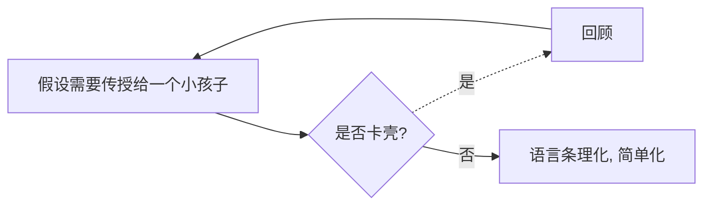

学习一个新的知识的时候，有没有一种茶壶里煮饺子，有货到不出的感觉？明明这个知识点我已经明白了，“掌握”的很好了，但是别人问我的时候，还是闪烁其词，讲不明白？遇到相同问题或者类似问题时，还是不会运用。

我们需要一个高效的学习方法--**费曼学习法**

<!-- more -->

## 什么是费曼学习法？

费曼学习法就是以通俗的语言来向别人传授你刚学到的知识点。平时我们的学习大部分都是被动的学习，或者说，学习的知识都没有很好的的到应用。比如说新学了一个知识点，能正确理解知识点的内容，以为自己已经掌握了，其实不然。学习有输入和输出两个过程，理解了知识点并不代表已经掌握了，就像茶壶里煮饺子，有货倒不出一样。如果能做到将高深的理论知识以通俗易懂的方式，解释给一个外行人听的话，才能说明真正掌握了这个知识。本质上来说：是以大妈级的语言来解释一些专业上的问题，用我们日常随处可见的现象来解释专业上的问题。总之：他是用极其具象的东西来回答高度抽象的东西。 

## 费曼学习法的步骤

费曼学习法分为四个步骤。 首先，假设你要把将要学习的知识传授给一个智力大概在8岁左右的小孩子，应该如何做，传授过程中是否有卡壳？如果有卡壳的地方，恰恰说明这里没有掌握，然后带着疑问重新学习资料，回顾。直到没有障碍为止，然后再简化语言，并将语言条理化。

### 一、把它教给一个小孩子 

拿出一张白纸，在上方写下你想要学习的主题。想一下，如果你要把它教给一个孩子，你会讲哪些，并写下来。这里你的教授对象不是你自己那些聪明的成年朋友，而是一个 8 岁的孩子，他的词汇量和注意力刚好能够理解基本概念和关系。

许多人会倾向于使用复杂的词汇和行话来掩盖他们不明白的东西。问题是我们只在糊弄自己，因为我们不知道自己也不明白。另外，使用行话会隐藏周围人对我们的误解。

当你自始至终都用孩子可以理解的简单的语言写出一个想法（提示：只用最常见的单词），那么你便迫使自己在更深层次上理解了该概念，并简化了观点之间的关系和联系。如果你努力，就会清楚地知道自己在哪里还有不明白的地方。这种紧张状态很好——预示着学习的机会到来了。

### 二、回顾

在第一步中，你不可避免地会卡壳，忘记重要的点，不能解释，或者说不能将重要的概念联系起来。

这一反馈相当宝贵，因为你已经发现了自己知识的边缘。懂得自己能力的界限也是一种能力，你刚刚就确定了一个！

这是学习开始的地方。现在你知道自己在哪里卡住了，那么就回到原始材料，重新学习，直到你可以用基本的术语解释这一概念。

认定自己知识的界限，会限制你可能犯的错误，并且在应用该知识时，可以增加成功的几率。

### 三、将语言条理化，简化

现在你手上有一套自己手写笔记，检查一下确保自己没有从原材料中借用任何行话。将这些笔记用简单的语言组织成一个流畅的故事。

将这个故事大声读出来，如果这些解释不够简单，或者听起来比较混乱，很好，这意味着你想要理解该领域，还需要做一些工作。

### 四、传授

如果你真的想确保你的理解没什么问题，就把它教给另一个人（理想状态下，这个人应该对这个话题知之甚少，或者就找个 8 岁的孩子）。检测知识最终的途径是你能有能力把它传播给另一个人。 

## 实践

## 参考文献

<https://www.quora.com/Learning-New-Things/How-can-you-learn-faster/answer/Acaz-Pereira> 

<https://www.zhihu.com/question/20576786> 

<https://wiki.mbalib.com/wiki/%E8%B4%B9%E6%9B%BC%E5%AD%A6%E4%B9%A0%E6%B3%95> 

